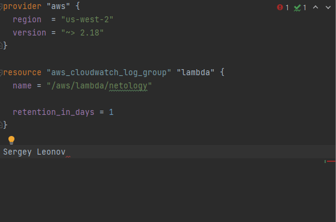

Домашнее задание N01
====================
от *23.10.2021*

Задача 1
--------
**Terraform** 

**Bash**

**Markdown**

**Yaml**

**Jsonnet**

Задача 2
--------
**Жизненный цикл задачи**

1. Заказчик хочет реализовать какую-то фишку; 
2. Представитель нашего стартапа обсуждает ТЗ и примерные сроки выполнения;
3. Заказчик предоставляет ТЗ и менеджер отдает QA на проверку выполнимости данного ТЗ - в тестировании на выполнимость требований могут принимать участие все лица, что будут задействованы в данной работе, в том числе DevOps;
4. Согласование ТЗ и сроков (Если на этапе 3 возникают сложности, то возращаемся к пункту 1);
5. DevOps + разрабы оценивают необходимые ресурсы (данный пункт может идти параллельно 3);
6. DevOps обеспечивает комфортную среду для команды (развертка инструментов, рутинные задачи, доустановка необходимого ПО)
7. Начинается разработка; 
8. Готовые сегменты кода тестируются QA, DevOps привлекается в случае необходимости (автоматизация, тех. поддержка и т.д.);
9. Собираем готовые сегменты и прогоняем "фичу" на предпродакшене; - участие DevOps по необходимости
10. Демонстрация заказчику;
11. Релиз;
12. Поддержка.
